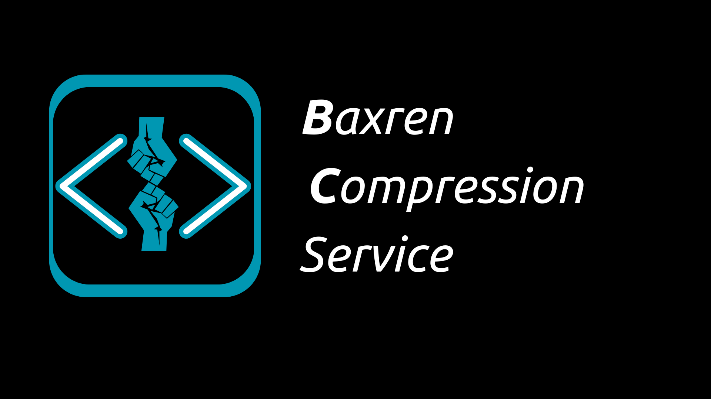

# BaxrenCompressionService


Terminalden Dosya Sıkıştırma Yazılımı. (.mp3, txt, odt, png, jpeg)

**BİR [BAXREN PROJECT](https://github.com/MrBaxren/BaxrenProject) YAZILIMIDIR**

**BaxrenCompressionService** yada kısa adıyla BCS, BaxrenProject kapsamında geliştirilen Linux terminali üzerinden belirtilen dosya formatlarındaki dosyaları sıkıştırmayı sağlayan bir yazılımdır. Yazılım açıldığında sizi bu yazı karşılayacak:

B     S     C

**Desteklenen Dosya Tipleri:**
**- Text Dosyaları (.txt)**
**- Görseller (.png, .jpeg)**
**- Ses Dosyaları (.mp3)**
Dosya Adı Girin:
____________________________

**Dosya Adı Girin** kısmına, yukarıdaki dosya formatlarında olan bilgisayardaki dosyaların isimleri yazılmalıdır.

# Kurulum
**1**-Python Kurma:

Debian/Ubuntu: 
sudo apt update
sudo apt install python3

Arch:
sudo pacman -S python

Fedora:
sudo dnf install python3

openSUSE:
sudo zypper install python3

Gentoo:
sudo emerge --ask python

CentOS:
sudo yum install python3

# Ön-Gereksinim
**Arch/Arch-Based:**
```bash
sudo pacman -S git
```
**Ubuntu**
```bash
sudo apt install git
```
**Fedora**
```bash
sudo dnf install git
```
**OpenSUSE**
```bash
sudo zypper install git
```
## Kurulum
```bash
git clone https://github.com/MrBaxren/BaxrenCompressionService).git
python BaxrenCalculatorCLI.py
```
EK NOTLAR: 
Karşılaştığınız sorunları iletebilir yada kendiniz deüzeltebilirsiniz


